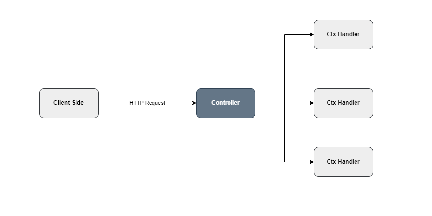

# Controller

A **Controller** in Tinh Tinh defines a set of route handlers responsible for processing incoming HTTP requests, extracting and validating data, invoking business logic, and returning responses. Controllers are grouped within modules and serve as the main entry point for API logic.



---

## Creating a Controller

Create a controller using the `NewController` method inside your module definition. Each controller typically handles a specific resource.

```go
import "github.com/tinh-tinh/tinhtinh/v2/core"

func NewUserController(module core.Module) core.Controller {
    ctrl := module.NewController("user")
    // Define routes here
    return ctrl
}
```

---

## Receiving Requests: Path, Query, and Body Parameters

### Path Parameters

Use a struct with field tags and `ctx.PathParser` to extract path parameters:

```go
type UserID struct {
    ID string `path:"id"`
}

ctrl.Get("{id}", func(ctx core.Ctx) error {
    var param UserID
    if err := ctx.PathParser(&param); err != nil {
        return ctx.JSON(core.Map{"error": err.Error()})
    }
    return ctx.JSON(core.Map{"id": param.ID})
})
```

### Query Parameters

Similarly, extract query parameters with a struct and `ctx.QueryParser`:

```go
type UserQuery struct {
    Name string `query:"name"`
}

ctrl.Get("", func(ctx core.Ctx) error {
    var query UserQuery
    if err := ctx.QueryParser(&query); err != nil {
        return ctx.JSON(core.Map{"error": err.Error()})
    }
    return ctx.JSON(core.Map{"name": query.Name})
})
```

### Request Body

To parse JSON body data, use a struct and `ctx.BodyParser`:

```go
type CreateUserDto struct {
    Username string `json:"username"`
    Email    string `json:"email"`
}

ctrl.Post("", func(ctx core.Ctx) error {
    var body CreateUserDto
    if err := ctx.BodyParser(&body); err != nil {
        return ctx.JSON(core.Map{"error": err.Error()})
    }
    // Use body.Username and body.Email
    return ctx.JSON(core.Map{"created": body.Username})
})
```

---

## Sending Responses

Use the context helpers to send responses:

```go
ctrl.Get("text", func(ctx core.Ctx) error {
    return ctx.Text("Hello, world!")
})

ctrl.Get("json", func(ctx core.Ctx) error {
    return ctx.JSON(core.Map{"message": "ok"})
})

ctrl.Get("custom-header", func(ctx core.Ctx) error {
    ctx.Res().Header().Set("X-Custom-Header", "value")
    return ctx.JSON(core.Map{"status": "custom header"})
})
```

---

## Registering Middleware in a Controller

Apply middleware to all routes of a specific controller:

```go
logger := func(ctx core.Ctx) error {
    log.Println("Request:", ctx.Req().URL.Path)
    return ctx.Next()
}

ctrl := module.NewController("user").Use(logger)
```

You can also apply middleware only for one route by chaining `.Use` before the route handler.

---

## Applying Controller-wide Compositions (`Registry`)

Call `Registry()` to ensure controller middlewares, guards, and pipes are applied consistently to all routes:

```go
ctrl := module.NewController("user").
    Use(logger).
    Guard(authGuard).
    Registry()

ctrl.Get("", listUsers)
ctrl.Get("{id}", getUser)
ctrl.Post("", createUser)
```

---

## Using Raw net/http Handlers with `Handler`

For advanced or low-level use cases, you can use `Handler` to register a native `http.HandlerFunc` for a route:

```go
import "net/http"

ctrl.Handler("raw", func(w http.ResponseWriter, r *http.Request) {
    w.Header().Set("Content-Type", "text/plain")
    w.WriteHeader(http.StatusOK)
    _, _ = w.Write([]byte("Hello from raw http.Handler!"))
})
```

- The first argument is the route path (e.g., `"raw"`).
- The second argument is your handler function (`func(http.ResponseWriter, *http.Request)`).

---

## Example: Typical HTTP Methods

```go
ctrl := module.NewController("user")

ctrl.Get("", func(ctx core.Ctx) error {
    return ctx.JSON(core.Map{"msg": "GET all users"})
})

ctrl.Get("{id}", func(ctx core.Ctx) error {
    var param struct {
        ID string `path:"id"`
    }
    if err := ctx.PathParser(&param); err != nil {
        return ctx.JSON(core.Map{"error": err.Error()})
    }
    return ctx.JSON(core.Map{"msg": "GET user by id", "id": param.ID})
})

ctrl.Post("", func(ctx core.Ctx) error {
    var body struct {
        Username string `json:"username"`
    }
    if err := ctx.BodyParser(&body); err != nil {
        return ctx.JSON(core.Map{"error": err.Error()})
    }
    return ctx.JSON(core.Map{"msg": "POST create user", "username": body.Username})
})

ctrl.Put("{id}", func(ctx core.Ctx) error {
    var param struct {
        ID string `path:"id"`
    }
    if err := ctx.PathParser(&param); err != nil {
        return ctx.JSON(core.Map{"error": err.Error()})
    }
    var body struct {
        Username string `json:"username"`
    }
    if err := ctx.BodyParser(&body); err != nil {
        return ctx.JSON(core.Map{"error": err.Error()})
    }
    return ctx.JSON(core.Map{"msg": "PUT update user", "id": param.ID, "username": body.Username})
})

ctrl.Patch("{id}", func(ctx core.Ctx) error {
    var param struct {
        ID string `path:"id"`
    }
    if err := ctx.PathParser(&param); err != nil {
        return ctx.JSON(core.Map{"error": err.Error()})
    }
    var body struct {
        Email string `json:"email"`
    }
    if err := ctx.BodyParser(&body); err != nil {
        return ctx.JSON(core.Map{"error": err.Error()})
    }
    return ctx.JSON(core.Map{"msg": "PATCH update user", "id": param.ID, "email": body.Email})
})

ctrl.Delete("{id}", func(ctx core.Ctx) error {
    var param struct {
        ID string `path:"id"`
    }
    if err := ctx.PathParser(&param); err != nil {
        return ctx.JSON(core.Map{"error": err.Error()})
    }
    return ctx.JSON(core.Map{"msg": "DELETE user", "id": param.ID})
})
```

---

## Summary

- Controllers bind routes to handler functions and extract request data using `BodyParser`, `QueryParser`, and `PathParser`.
- Register middleware at the controller or per-route level.
- Use `.Registry()` for consistent application of middleware/guards/pipes to all controller routes.
- Use `Handler` to attach a raw `http.HandlerFunc` for maximum control.
- Refer to `/core/ctx_test.go` and other test files for more usage patterns.