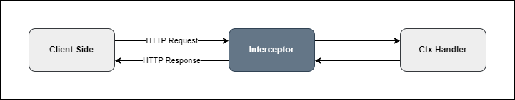

# Interceptor

A middleware responsible transform data after response



Interceptor is use for transform data after response in controller.

```go
func Transform(ctx core.Ctx) core.CallHandler {
	fmt.Println("Before ...")
	now := time.Now()
	return func(data core.Map) core.Map {
		res := make(core.Map)
		for key, val := range data {
			if val != nil {
				res[key] = val
			}
		}
		fmt.Printf("After ...%vns\n", time.Since(now).Nanoseconds())
		return res
	}
}
```

Use in controller:

```go
ctrl := module.NewController("test")

ctrl.Interceptor(Transform).Get("", func(ctx core.Ctx) error {
  return ctx.JSON(core.Map{
    "data":    "ok",
    "total":   10,
    "message": nil,
  })
})
```

Data when response is will:

```json
{"data":"ok","total":10}
```