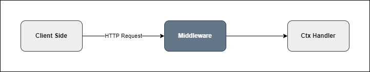

# Middleware

Tinh Tinh middleware lets you run logic before your route handlers, at the controller or module level, or selectively with Consumers.



---

## Summary of Features

- Allow custom middleware: You can create your own middleware functions to process requests and responses.
- Allow registering middleware for a single route: Attach middleware directly to individual controller routes.
- Allow registering middleware for multiple routes in a controller: Apply middleware to all routes in a controller at once.
- Allow registering middleware for all controllers in a module: Apply middleware globally within a module via configuration.
- Allow conditional middleware with Consumer: Apply middleware to selected routes (include/exclude) using Consumer on the module instance.
- Support middleware with dependency injection: Middleware can access providers/services using MiddlewareRef.

---

## 1. Define Middleware

A middleware is a function:

```go
func MyMiddleware(ctx core.Ctx) error {
    // your logic
    return ctx.Next() // call next middleware/handler
}
```

---

## 2. Add Middleware to a Controller Route

Attach to one route only:

```go
ctrl := module.NewController("user")
ctrl.Use(MyMiddleware).Get("/profile", func(ctx core.Ctx) error {
    return ctx.JSON(core.Map{"msg": "with middleware"})
})
```

---

## 3. Add Middleware for Multiple Routes in Controller

Apply to all routes in the controller:

```go
ctrl := module.NewController("admin").
    Use(MyMiddleware).
    Registry()

ctrl.Get("/stats", handlerA)
ctrl.Get("/logs", handlerB)
```

---

## 4. Middleware for Module

Apply to all controllers in a module:

```go
mod := module.New(core.NewModuleOptions{
    Middlewares: []core.Middleware{MyMiddleware},
})
```

---

## 5. Use Consumer to Apply Middleware for Custom Routes in a Module

You can use `Consumer` to selectively apply one or more middlewares to specific routes in your module tree, using include/exclude rules.  
This is applied on the module instance (which can be used as the app root).

### Example

```go
app := core.NewModule(core.NewModuleOptions{
    Imports: []core.Modules{userModule, postModule},
})

// Apply tenantMiddleware to all routes
app.Consumer(core.NewConsumer().Apply(tenantMiddleware).Include(core.RoutesPath{
    Path: "*", Method: core.MethodAll,
}))

// Apply locationMiddleware to all routes except /post/exclude
app.Consumer(core.NewConsumer().Apply(locationMiddleware).Exclude(core.RoutesPath{
    Path: "/post/exclude", Method: core.MethodAll,
}))
```

- `Include()` specifies which routes and methods get the middleware.  
  Use `Path: "*"` or `Method: core.MethodAll` for wildcards (all paths or all methods).
- `Exclude()` removes routes from the effect.
- If no includes are set, the middleware applies to all routes by default.

---

## 6. MiddlewareRef: Access Providers in Middleware

If your middleware needs to access a service/provider:

```go
func AuthMiddleware(ref core.RefProvider, ctx core.Ctx) error {
    auth := ref.Ref("AuthService")
    // use auth here
    return ctx.Next()
}

// Attach to controller
ctrl.UseRef(AuthMiddleware).Get("/secure", handler)
```

Or apply to module:

```go
mod := module.New(core.NewModuleOptions{
    MiddlewaresRef: []core.MiddlewareRef{AuthMiddleware},
})
```

---

**For more, see the [Tinh Tinh middleware tests and examples](https://github.com/tinh-tinh/tinhtinh/search?q=middleware).**
