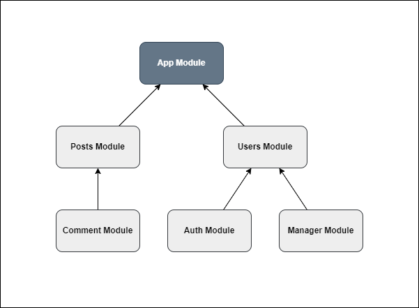

# Module



## What is a Module?

A **Module** in Tinh Tinh is a fundamental building block that encapsulates a cohesive set of controllers, providers (services), middleware, guards, and configuration. Modules enable you to organize your code into logical, reusable, and testable units, supporting both small and large-scale applications.

Modules can be composed, imported, and exported, allowing for hierarchical and feature-based app architecture—similar to dependency injection systems in other modern frameworks.

---

## Module Features

- **Encapsulation:** Bundle related controllers, providers, middleware, and guards in a single unit.
- **Dependency Injection:** Register and inject services/providers with support for different lifecycles (`Global`, `Request`, `Transient`).
- **Composable Imports/Exports:** Import other modules and export services/providers for reusability.
- **Hierarchical Structure:** Model your app as a tree of modules, with clear boundaries and dependencies.
- **Custom Initialization:** Use `OnInit` hooks for module-level bootstrapping.
- **Scoping:** Define the visibility and lifecycle of providers within and across modules.
- **Middleware & Guards:** Attach middleware and guards at module-level.
- **Extensibility:** Add custom consumers, global interceptors, and more.

---

## Creating a Module

The most common way is using `core.NewModule` with `core.NewModuleOptions`:

```go
import "github.com/tinh-tinh/tinhtinh/v2/core"

func NewAppModule() core.Module {
    return core.NewModule(core.NewModuleOptions{
        Controllers: []core.Controllers{UserController, ArticleController},
        Providers:   []core.Providers{UserService},
        Middlewares: []core.Middleware{LoggerMiddleware},
        Imports:     []core.Modules{OtherModule},
        Exports:     []core.Providers{UserService}, // Export providers for other modules
        Scope:       core.Global, // or core.Request, core.Transient
    })
}
```

---

## Passing Parameters to a Module

When initializing a module, you can pass configuration via the `NewModuleOptions` struct. Each module receives its own options, which can include:

- **Controllers:** Array of controller constructors.
- **Providers:** Array of provider/service constructors.
- **Imports:** Other modules to import dependencies from.
- **Exports:** Which providers/services to export.
- **Middlewares:** Functions to run on all requests within the module.
- **Guards:** Access control functions.
- **Scope:** Singleton, per-request, or per-injection (`Global`, `Request`, `Transient`).
- **Custom Options:** You can extend the pattern to accept custom configs in your own code.

Example:

```go
type MyConfig struct {
    Debug bool
}

// Pass as needed when constructing providers or wiring up modules
core.NewModule(core.NewModuleOptions{
    Providers: []core.Providers{
        func(module core.Module) core.Provider {
            return module.NewProvider(core.ProviderOptions{
                Name: "config",
                Value: &MyConfig{Debug: true},
            })
        },
    },
})
```

---

## Hierarchical Modules: Multi-Module Initialization

Modules can import other modules, forming a tree-like structure. This enables clear separation of features and easy reusability.

```go
func SubModule(module core.Module) core.Module {
    sub := module.New(core.NewModuleOptions{
        Controllers: []core.Controllers{SubController},
        Providers:   []core.Providers{SubService},
        Exports:     []core.Providers{SubService},
    })
    return sub
}

func ParentModule(module core.Module) core.Module {
    parent := module.New(core.NewModuleOptions{
        Imports:     []core.Modules{SubModule},
        Controllers: []core.Controllers{ParentController},
        Providers:   []core.Providers{ParentService},
        Exports:     []core.Providers{ParentService},
    })
    return parent
}

func AppModule() core.Module {
    return core.NewModule(core.NewModuleOptions{
        Imports: []core.Modules{ParentModule},
        Controllers: []core.Controllers{AppController},
    })
}
```

- **Importing:** Use the `Imports` option to compose features.
- **Exporting:** Use `Exports` to make providers/services available to parent modules.
- **Dependency Resolution:** Providers and controllers can inject dependencies from their own module or any imported/exported modules.

---

## Example: Minimal Module Setup

```go
package app

import "github.com/tinh-tinh/tinhtinh/v2/core"

func NewModule() core.Module {
    appModule := core.NewModule(core.NewModuleOptions{
        Controllers: []core.Controllers{NewController},
        Providers:   []core.Providers{NewService},
    })
    return appModule
}
```

---

## Module Hooks

- **OnInit:** Register initialization hooks for setup logic inside the module.

### Middleware and Guards

- **Use:** Attach middleware to all controllers/routes inside the module.
- **Guard:** Attach guards (authorization logic) to all controllers/routes inside the module.

---

## Summary

- Modules are the foundation of Tinh Tinh's architecture.
- They enable encapsulation, hierarchy, dependency injection, and easy code organization.
- Compose modules hierarchically to scale your application while maintaining separation of concerns and reusability.

For advanced patterns, see the source code and test files in `/core`.