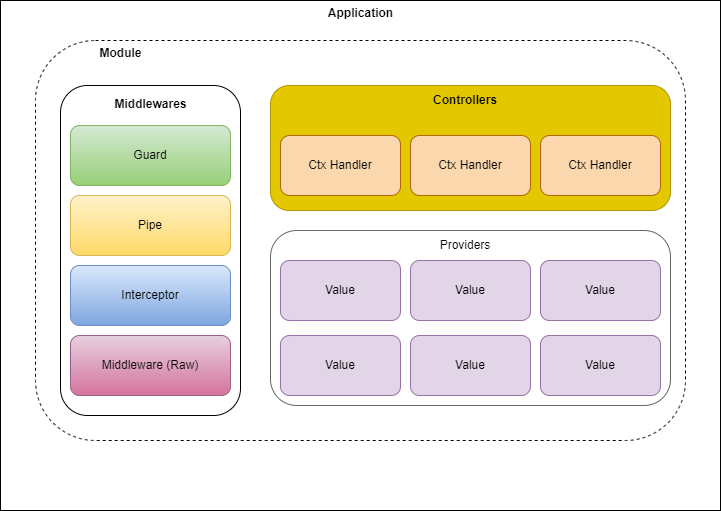

# Overview



## What is Tinh Tinh?

Tinh Tinh is a progressive Go framework designed to help developers build efficient, scalable, and enterprise-grade server-side applications. Its architecture is inspired by modern backend frameworks, providing a modular and extensible foundation with a strong focus on testability, maintainability, and developer productivity.

### Core Principles

- **Modular Architecture:** Code is organized into modules, each encapsulating controllers, providers (services), middleware, and configuration.
- **Dependency Injection:** Powerful, flexible provider system supporting global, request, and transient lifecycles.
- **Extensible Middleware:** Middleware can be registered globally, per module, or per controller for cross-cutting concerns.
- **Declarative Routing:** Controllers define RESTful routes with clear, testable handler functions.
- **Validation & DTOs:** Pipes and DTOs provide automatic request data parsing and validation.
- **Guards & Interceptors:** Built-in mechanisms for authorization and response transformation.
- **Easy Testing:** The modular approach and context abstraction make the framework naturally testable.
- **First-class CLI support** for rapid project scaffolding and automation (see below).

### Quick Install

```bash
go get -u github.com/tinh-tinh/tinhtinh/v2
```

## How Tinh Tinh Works

- **Modules** group related functionality and support easy composition of large apps.
- **Controllers** define endpoints and bind business logic to routes.
- **Providers** (services) offer dependency-injected business logic.
- **Middleware** adds reusable request/response logic.
- **Pipes** validate and transform incoming data.
- **Guards** enforce authorization policies.
- **Interceptors** allow unified response shaping or logging.

Example structure generated by the CLI:

```
my-app/
├── main.go
└── app/
    ├── app_module.go
    ├── app_controller.go
    └── app_service.go
```

---

## tinhtinh-cli: Rapid Project Generator

**tinhtinh-cli** is the official command-line tool for Tinh Tinh, designed to streamline project creation and automation.

### Features

- **Project Initialization:** Instantly scaffold a new Tinh Tinh project with best practices.
- **Automated Boilerplate:** Generates main.go, modules, controllers, services, middleware, and guards with ready-to-use code.
- **Go Module Setup:** Handles `go mod init` and dependency management automatically.
- **Customizable:** Supports custom package names and optional Git repo cloning.

### Installation

```bash
go install github.com/tinh-tinh/tinhtinh-cli/v2@latest
```

### Usage

```bash
tinhtinh-cli init my-service
```

This command will:
- Create a new project directory
- Initialize a Go module
- Generate a main entry point and starter app structure
- Scaffold controller and service templates

### Example Generated App

```go
package main

import (
    "github.com/tinh-tinh/tinhtinh/v2/core"
    "my-service/app"
)

func main() {
    server := core.CreateFactory(app.NewModule)
    server.Listen(3000)
}
```

---

## Why Use Tinh Tinh?

- **Modern Go backend development:** Clear patterns, modularity, and best practices out of the box.
- **Supercharged productivity:** The CLI and framework together let you focus on your business logic, not boilerplate.
- **Scalable architecture:** Built-in support for scalable service patterns, validation, and lifecycle management.

---

For more details and advanced topics, see the individual sections on modules, controllers, providers, middleware, pipes, guards, and interceptors.