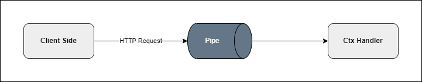

# Pipe

A middleware responsible for validating and transforming data before it reaches the controller.



A pipe is a function that validates and transforms request data before the handler function. There are 3 types of pipes:
- **Body**: Validates and transforms data from the request body
- **Query**: Validates and transforms data from the request query
- **Param**: Validates and transforms data from the request params

## Body

```go
// Define DTO

type SignUpDto struct {
  Name     string `validate:"required"`
  Email    string `validate:"required,isEmail"`
  Password string `validate:"isStrongPassword"`
  Age      int    `validate:"isInt"`
}
```

Use in controller:

```go
package app

import "github.com/tinh-tinh/tinhtinh/v2/core"

func Controller(module core.Module) core.Controller {
  ctrl := module.NewController("test")
  
  ctrl.Pipe(core.Body(SignUpDto{})).Post("", func (ctx core.Ctx) error {
    return ctx.JSON(core.Map{
      "data": ctx.Body(),
    })
  })
  
  return ctrl
}
```

## Query

Define DTO for query:

```go
package app

import "github.com/tinh-tinh/tinhtinh/v2/core"

type FilterDto struct {
  Name  string `validate:"required" query:"name"`
  Email string `validate:"required,isEmail" query:"email"`
  Age   int    `validate:"isInt" query:"age"`
}

func Controller(module core.Module) core.Controller {
  ctrl := module.NewController("test")
  
  ctrl.Pipe(core.Query(FilterDto{})).Post("", func (ctx core.Ctx) error {
    return ctx.JSON(core.Map{
      "data": ctx.Queries(),
    })
  })
  
  return ctrl
}
```

## Param

Define DTO for param:

```go
package app

import "github.com/tinh-tinh/tinhtinh/v2/core"

type ParamDto struct {
  ID int `validate:"required,isInt" param:"id"`
}

func Controller(module core.Module) core.Controller {
  ctrl := module.NewController("test")
  
  ctrl.Pipe(core.Param(ParamDto{})).Get("{id}", func (ctx core.Ctx) error {
    return ctx.JSON(core.Map{
      "data": ctx.Params(),
    })
  })
  
  return ctrl
}
```