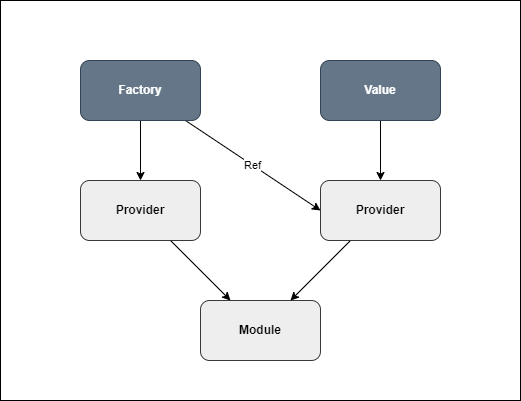

# Provider

A **Provider** in Tinh Tinh is the core mechanism for dependency injection. Providers can represent values, structs, or factory functions. They are registered within modules and can be injected into controllers, other providers, or exported/imported across modules.



---

## How to Create Providers

### 1. Provider With Name

Explicitly assign a name using the `Name` field:

```go
func ChildProvider(module core.Module) core.Provider {
    return module.NewProvider(core.ProviderOptions{
        Name:  "child",
        Value: "child",
    })
}
```

Register in your module:

```go
core.NewModule(core.NewModuleOptions{
    Providers: []core.Providers{ChildProvider},
})
```

---

### 2. Provider Without Name (Type-based Struct Pointer)

If you pass a **pointer to a struct** (e.g., `&Service{}`) to `NewProvider`, the provider name will be inferred from the struct type name (e.g., `"Service"`).

```go
type Service struct {
    Value string
}

func ServiceProvider(module core.Module) core.Provider {
    return module.NewProvider(&Service{Value: "service"})
}
```

You can inject it by type using the `core.Inject[T](ref core.RefProvider)` helper:

```go
svc := core.Inject[Service](module) // module or ctrl, both implement RefProvider
```

Or in a controller:

```go
ctrl.Get("", func(ctx core.Ctx) error {
    svc := core.Inject[Service](ctrl)
    return ctx.JSON(core.Map{"data": svc.Value})
})
```

---

### 3. Provider With Value

You can provide any value:

```go
func ConfigProvider(module core.Module) core.Provider {
    return module.NewProvider(core.ProviderOptions{
        Name:  "config",
        Value: struct{ Debug bool }{Debug: true},
    })
}
```

---

### 4. Factory Providers

Use a Factory function and Inject to define providers with dynamic or dependent values.

```go
func FactoryProvider(module core.Module) core.Provider {
    return module.NewProvider(core.ProviderOptions{
        Name: "child",
        Factory: func(param ...interface{}) interface{} {
            return fmt.Sprintf("%vChild", param[0])
        },
        Inject: []core.Provide{core.Provide("root")},
    })
}
```

---

## Provider Scope (Lifecycle)

Set the provider's scope with the `Scope` field in `ProviderOptions`:

- `core.Global` (default): Singleton (shared, one instance per app).
- `core.Request`: New instance per HTTP request.
- `core.Transient`: New instance every time it is injected.

---

### Example: Global (Singleton) Provider

A global provider is created once and shared everywhere it is injected.

```go
type StructName struct {
    Name string
}

parentModule := func(module core.Module) core.Module {
    parent := module.New(core.NewModuleOptions{
        Scope: core.Global, // <-- Singleton scope
    })
    parent.NewProvider(core.ProviderOptions{
        Name: "parent",
        Value: &StructName{
            Name: "parent",
        },
    })
    parent.Export("parent")
    return parent
}

module := core.NewModule(core.NewModuleOptions{
    Imports: []core.Modules{parentModule},
})

p1 := module.Ref("parent").(*StructName)
p2 := module.Ref("parent").(*StructName)
// Always the same pointer:
require.Same(t, p1, p2)
```
Every time you inject or reference `"parent"`, you get the same instance.

---

### Example: Request-Scoped Provider

A request provider gives a new instance for every HTTP request.

```go
type RequestProvider struct {
    Name string
}

tenantModule := func(module core.Module) core.Module {
    tenant := module.New(core.NewModuleOptions{})
    tenant.NewProvider(core.ProviderOptions{
        Scope: core.Request, // <-- Per-request scope
        Name:  "service",
        Factory: func(param ...interface{}) interface{} {
            return &RequestProvider{Name: "model" + param[0].(string)}
        },
        Inject: []core.Provide{"TENANT"},
    })
    tenant.Export("service")
    return tenant
}

// In your test, different requests will get different instances:
module := core.NewModule(core.NewModuleOptions{
    Imports: []core.Modules{tenantModule},
})

// ...simulate HTTP requests, then:
svc1 := module.Ref("service").(*RequestProvider)
svc2 := module.Ref("service").(*RequestProvider)
// Different instances per request:
require.NotSame(t, svc1, svc2)
```
Each HTTP request gets a fresh instance of the `"service"` provider.

---

### Example: Transient Provider

A **transient** provider creates a new instance every time it is injected or resolved, unlike singletons (global scope) which always return the same instance.

```go
type StructName struct {
    Name string
}

parentModule := func(module core.Module) core.Module {
    parent := module.New(core.NewModuleOptions{
        Scope: core.Global,
    })
    parent.NewProvider(core.ProviderOptions{
        Name: "parent",
        Value: &StructName{
            Name: "parent",
        },
    })
    parent.Export("parent")
    return parent
}

childModule := func(module core.Module) core.Module {
    child := module.New(core.NewModuleOptions{
        Scope: core.Transient,
    })
    child.NewProvider(core.ProviderOptions{
        Name: "child",
        Factory: func(param ...interface{}) interface{} {
            parent := param[0].(*StructName)
            return &StructName{
                Name: fmt.Sprintf("%vChild", parent.Name),
            }
        },
        Inject: []core.Provide{core.Provide("parent")},
    })
    child.Export("child")
    return child
}

module := core.NewModule(core.NewModuleOptions{
    Imports: []core.Modules{parentModule, childModule},
})

// Singleton (global): always the same instance
p1 := module.Ref("parent").(*StructName)
p2 := module.Ref("parent").(*StructName)
require.Same(t, p1, p2)

// Transient: new instance every time
c1 := module.Ref("child").(*StructName)
c2 := module.Ref("child").(*StructName)
require.NotSame(t, c1, c2)
```

When resolving `"parent"`, you always get the same pointer (singleton).  
When resolving `"child"`, you always get a new pointer (transient).

---

## Importing and Exporting Providers

You can share providers between modules by exporting and importing.

To export a provider for use by other modules, add it to your module’s `Exports`:

```go
core.NewModule(core.NewModuleOptions{
    Providers: []core.Providers{ChildProvider},
    Exports:   []core.Providers{ChildProvider},
})
```

To import providers from other modules:

```go
core.NewModule(core.NewModuleOptions{
    Imports: []core.Modules{OtherModule},
})
```

---

## Referencing (Injecting) Providers

You can reference providers in controllers or other providers with:

- **By name:**  
  ```go
  ctrl.Ref("child")
  ```
- **By struct type (when using type-based provider and pointer):**  
  ```go
  core.Inject[Service](ctrl) // or (module)
  ```

---

## Summary

- Providers can be registered with a name or as a pointer to a struct (type-based).
- Type-based providers are injected with `core.Inject[Type](ref core.RefProvider)`.
- Factories and `Inject` support complex dependency graphs.
- Providers can be scoped as singleton (`Global`), per-request, or transient.
- Providers can be exported/imported across modules.

