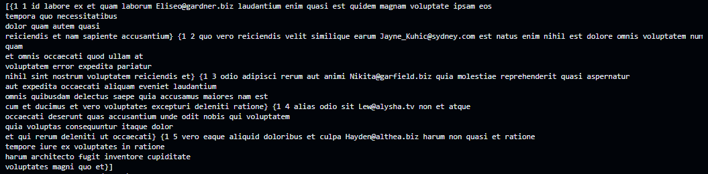

# HTTP Fetch

Package support request a HTTP call with schema for request and response data.

## Install

```go
go get -u github.com/tinh-tinh/fetch
```

## Usage

Register module `fetch` in app module:

```go
appModule := core.NewModule(core.NewModuleOptions{
  Imports: []core.Module{
    fetch.Register(&fetch.Config{
      BaseUrl: "https://example.com",
    }),
  },
})
```

Use in module:

```go
func Controller(module *core.DynamicModule) *core.DynamicController {
  ctrl := module.NewController("posts")
  httpFetch := fetch.Inject(module)

  ctrl.Get("/", func(ctx core.Ctx) error {
    type Post struct {
      UserID int    `json:"userId"`
      ID     int    `json:"id"`
      Title  string `json:"title"`
      Body   string `json:"body"`
    }

    type Posts []Post
    var data Posts
    res := httpFetch.Get("posts").Format(&data)

    return ctx.Status(res.Status).JSON(core.Map{
      "data": data,
    })
  })
}
```

## Config in fetch

Beside `BaseUrl` you have some options for config:

```go
fetch.Register(&fetch.Config{
  BaseUrl:      "https://jsonplaceholder.typicode.com",
  Headers:      http.Header{"x-api-key": []string{"abcd", "efgh"}},
  ResponseType: "json",
  Params: map[string]interface{}{
    "foo": "bar",
  },
  Timeout: 5 * time.Minutes,
})
```

## Format data json

Fetch support function `Format` to convert data bytes to your data types:

```go
type Comment struct {
  PostID int    `json:"postId"`
  ID     int    `json:"id"`
  Name   string `json:"name"`
  Email  string `json:"email"`
  Body   string `json:"body"`
}
type Comments []Comment
type QueryComment struct {
  PostID int `query:"postId"`
}
var comments Comments
res := httpFetch.Get("comments", &QueryComment{
  PostID: 1,
}).Format(&comments)

fmt.Println(comments)
```

Data will appear in `comments`:



You can use `res` to check something base on attributes of `res`:

```go
type Response struct {
	Data       []byte "raw data"
	Status     int    "http status code, eg: 200"
	StatusText string "http status text, eg: 200 OK"
	Error      error  "error, if any"
}
```