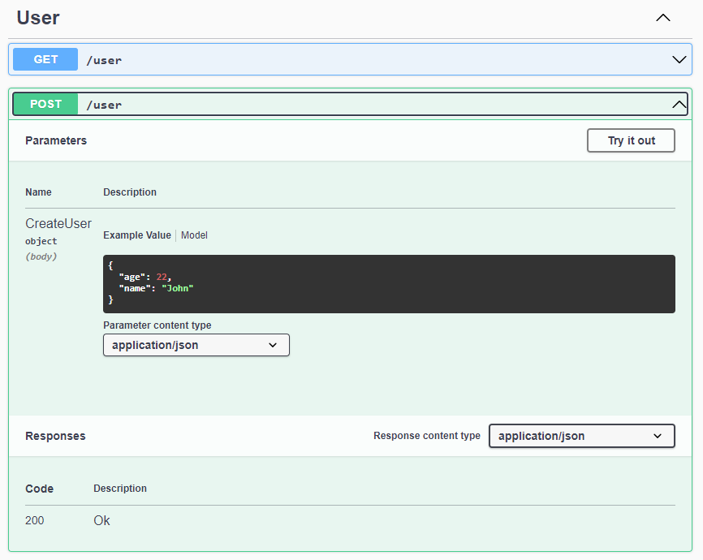
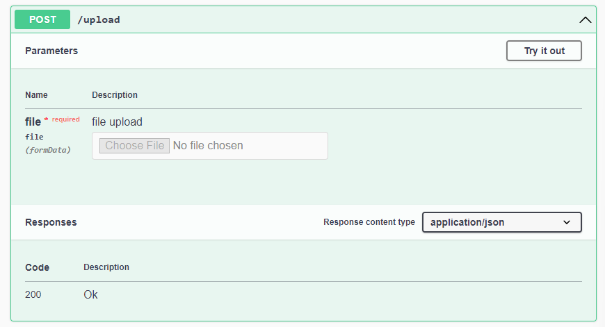

# Swagger

Package support create swagger base on Restful App.

## Install 

```bash
go get -u github.com/tinh-tinh/swagger/v2
```

## Usage

```go
package main

import (
  "social-network/app"

  "github.com/tinh-tinh/tinhtinh/v2/core"
  "github.com/tinh-tinh/swagger/v2"
)

func main() {
  server := core.CreateFactory(app.NewModule)
  server.SetGlobalPrefix("api")

  document := swagger.NewSpecBuilder()
  document.SetHost("localhost:3000").SetBasePath("/api")

  swagger.SetUp("docs", server, document)
  server.Listen(3000)
}
```

### ApiTag

You can tagged controller in module by use `ApiTag` and pass as metadata:

```go
ctrl := module.NewController("user").Metadata(swagger.ApiTag("Use")).Registry()
```

### ApiSecurity

If you need authenticate in swagger, you can enable it when create swagger doc:

```go
package main

import (
	"social-network/app"

  "github.com/tinh-tinh/swagger/v2"
	"github.com/tinh-tinh/tinhtinh/v2/core"
)

func main() {
  server := core.CreateFactory(app.NewModule)
  server.SetGlobalPrefix("api")

  document := swagger.NewSpecBuilder()
  document.SetHost("localhost:3000").SetBasePath("/api").AddSecurity(&swagger.SecuritySchemeObject{
    Type: "apiKey",
    In:   "header",
    Name: "Authorization",
  })

  swagger.SetUp("docs", server, document)
  server.Listen(3000)
}
```

And you can specific route use it by pass metadata is `ApiSecurity`:

```go
ctrl.Metadata(
  swagger.ApiSecurity("authorization"),
).Post("/", func(ctx core.Ctx) error {
  return ctx.JSON(core.Map{"data": "ok"})
})
```

### Schema Dto

In case you need indicate your schema in swagger, you need only define struct with tag`example`:

```go
type CreateUser struct {
  Name string `json:"name" validate:"required" example:"John"`
  Age  int    `json:"age" validate:"required,isInt" example:"22"`
}
```

And add it in `Pipe` :

```go
ctrl.Pipe(core.Body(&dto.CreateUser{})).Post("/", func(ctx core.Ctx) error {
  return ctx.JSON(core.Map{"data": "ok"})
})
```

The schema model will reflect in Swagger:



Similar with query and param

### Upload file

If you need upload file in swagger, you can use `ApiConsumer` and `ApiFile` functions as metadata.

```go
ctrl.Metadata(
  swagger.ApiConsumer("multipart/form-data"),
  swagger.ApiFile(swagger.FileOptions{
    Name:        "file",
    Description: "file upload",
    Required:    true,
  }),
).Post("/upload", func(ctx core.Ctx) error {
  return ctx.JSON(core.Map{"data": "ok"})
})
```

The swagger will be:


